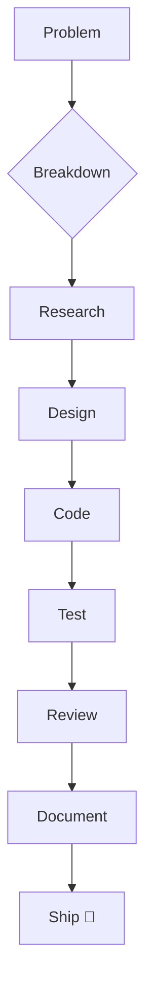

<!--
     ███████╗██╗   ██╗██╗   ██╗██████╗ ██████╗  █████╗      ██╗   ██╗██╗   ██╗██╗   ██╗██████╗ ███╗   ██╗████████╗
     ██╔════╝██║   ██║██║   ██║██╔══██╗██╔══██╗██╔══██╗     ██║   ██║██║   ██║██║   ██║██╔══██╗████╗  ██║╚══██╔══╝
     █████╗  ██║   ██║██║   ██║██████╔╝██████╔╝███████║     ██║   ██║██║   ██║██║   ██║██████╔╝██╔██╗ ██║   ██║   
     ██╔══╝  ╚██╗ ██╔╝██║   ██║██╔═══╝ ██╔══██╗██╔══██║     ╚██╗ ██╔╝██║   ██║██║   ██║██╔═══╝ ██║╚██╗██║   ██║   
     ███████╗ ╚████╔╝ ╚██████╔╝██║     ██║  ██║██║  ██║      ╚████╔╝ ╚██████╔╝╚██████╔╝██║     ██║ ╚████║   ██║   
     ╚══════╝  ╚═══╝   ╚═════╝ ╚═╝     ╚═╝  ╚═╝╚═╝  ╚═╝       ╚═══╝   ╚═════╝  ╚═════╝ ╚═╝     ╚═╝  ╚═══╝   ╚═╝   
-->

<p align="center">
  
</p>

<p align="center">
  <a href="https://github.com/yuvrajkurmi03">
    
  </a>
  <a href="https://yuvrajkurmi.onrender.com">
    
  </a>
  <a href="mailto:yuvrajkurmi03@gmail.com">
    
  </a>
  
</p>

---

<!-- Profile Overview -->
<div align="center">


# 𝚈𝚞𝚟𝚛𝚊𝚓

**Passionate about creating robust, scalable, and maintainable solutions.**

> “Code is like humor. When you have to explain it, it’s bad.” – Cory House

[](https://yuvrajkurmi.onrender.com)
[](https://github.com/yuvrajkurmi03)
[](mailto:yuvrajkurmi03@gmail.com)

</div>

---

## 🎨 &nbsp;**About Me**

```yaml
name: 𝙳𝚎𝚟𝚈𝚞𝚟𝚛𝚊𝚓
bio: >
  👋 Hi, I'm Yuvraj—a passionate developer focused on writing clean, efficient,
  and maintainable code.
portfolio: "https://yuvrajkurmi.onrender.com/"
hireable: true
location: "🌍 Earth"
languages:
  - JavaScript
  - TypeScript
  - Python
  - C++
frameworks:
  - React
  - Node.js
  - Express
  - Next.js
databases:
  - MongoDB
  - PostgreSQL
  - MySQL
tools:
  - Git
  - Docker
  - VS Code
  - Linux
  - REST APIs
  - GraphQL
```

---

## 🧑‍💻 &nbsp;**My Philosophy**

> I write code that’s not only functional but also elegant and easy to maintain.  
> I believe in continuous learning, collaboration, and sharing knowledge with the community.

---

## 🛠️ &nbsp;**Tech Stack**

<p align="center">
  
</p>

---

## 📊 &nbsp;**GitHub Stats**

<p align="center">
  
  
</p>

<p align="center">
  
</p>

---

## 🚩 &nbsp;**Featured (Pinned) Projects**

> *Results below show your most popular/significant repositories. There are 36 repositories in total. [View all on GitHub](https://github.com/search?q=user:yuvrajkurmi03&sort=stars&order=desc).*

<table>
  <tr>
    <td width="50%">
      <h4 align="center"><a href="https://github.com/yuvrajkurmi03/yuvrajkurmi03">yuvrajkurmi03</a></h4>
      <p align="center">
        
      </p>
      <p align="center">Personal profile/README repository.</p>
      <p align="center">
        <a href="https://github.com/yuvrajkurmi03/yuvrajkurmi03"></a>
      </p>
    </td>
    <td width="50%">
      <h4 align="center"><a href="https://github.com/yuvrajkurmi03/StreamVerse">StreamVerse</a></h4>
      <p align="center">
        
      </p>
      <p align="center">Streaming platform application.</p>
      <p align="center">
        <a href="https://github.com/yuvrajkurmi03/StreamVerse"></a>
      </p>
    </td>
  </tr>
  <tr>
    <td width="50%">
      <h4 align="center"><a href="https://github.com/yuvrajkurmi03/Text1">Text1</a></h4>
      <p align="center">
        
      </p>
      <p align="center">Text utility or manipulation project.</p>
      <p align="center">
        <a href="https://github.com/yuvrajkurmi03/Text1"></a>
      </p>
    </td>
    <td width="50%">
      <h4 align="center"><a href="https://github.com/yuvrajkurmi03/CodePulse">CodePulse</a></h4>
      <p align="center">
        
      </p>
      <p align="center">Project for code monitoring or insights.</p>
      <p align="center">
        <a href="https://github.com/yuvrajkurmi03/CodePulse"></a>
      </p>
    </td>
  </tr>
  <tr>
    <td width="50%">
      <h4 align="center"><a href="https://github.com/yuvrajkurmi03/web">web</a></h4>
      <p align="center">
        
      </p>
      <p align="center">Web development experiments.</p>
      <p align="center">
        <a href="https://github.com/yuvrajkurmi03/web"></a>
      </p>
    </td>
    <td width="50%">
      <h4 align="center"><a href="https://github.com/yuvrajkurmi03/projects">projects</a></h4>
      <p align="center">
        
      </p>
      <p align="center">Miscellaneous project collection.</p>
      <p align="center">
        <a href="https://github.com/yuvrajkurmi03/projects"></a>
      </p>
    </td>
  </tr>
</table>

---

## 🚀 &nbsp;**What I’m Working On**

- Building scalable web applications with modern JavaScript frameworks.
- Exploring advanced backend architectures and cloud-native solutions.
- Learning about AI, ML, and data-driven applications.
- Contributing to open-source projects and collaborating with other developers.

---

## 📚 &nbsp;**Recent Blog Posts**

<!-- BLOG-POST-LIST:START -->
- [How to Write Clean, Maintainable Code](https://yuvrajkurmi.onrender.com/blog/clean-code)
- [Getting Started with Docker for Developers](https://yuvrajkurmi.onrender.com/blog/docker-basics)
- [REST vs GraphQL: Choosing the Right API](https://yuvrajkurmi.onrender.com/blog/rest-vs-graphql)
<!-- BLOG-POST-LIST:END -->

---

## 💡 &nbsp;**My Principles**

- **Simplicity**: Simple code is maintainable code.
- **Readability**: Code is read more often than it is written.
- **Efficiency**: Optimize for clarity and performance.
- **Testing**: Test early, test often.
- **Documentation**: Good docs save time for everyone.

---

## 🌏 &nbsp;**Let's Connect!**

<p align="center">
  <a href="https://github.com/yuvrajkurmi03"></a>
  <a href="https://yuvrajkurmi.onrender.com"></a>
  <a href="mailto:yuvrajkurmi03@gmail.com"></a>
  <a href="#"></a>
</p>

---

## 🏅 &nbsp;**Achievements**

- 🏆 **17+ Public Repositories**
- 🧑‍💼 **Open for Hire**
- 🫂 **5+ Followers**
- 💡 **Continuous Learner & Innovator**

---

## 🔥 &nbsp;**My GitHub Contributions**

<p align="center">
  
</p>

---

## 📝 &nbsp;**My Workflow**



---

## 💬 &nbsp;**Quotes I Live By**

> “First, solve the problem. Then, write the code.” – John Johnson  
> “Simplicity is the soul of efficiency.” – Austin Freeman  
> “Experience is the name everyone gives to their mistakes.” – Oscar Wilde  
> “Clean code always looks like it was written by someone who cares.” – Michael Feathers  

---

## 🧩 &nbsp;**Fun Facts**

- I love debugging and solving complex problems.
- I believe in the power of open-source.
- I enjoy learning new things every day.
- I take pride in clean, elegant code.

---

## 📦 &nbsp;**More About Me**

<details>
  <summary>🌱 Current Learning</summary>
  <ul>
    <li>Advanced React patterns</li>
    <li>GraphQL & Apollo</li>
    <li>Docker and Kubernetes</li>
    <li>Microservices Architecture</li>
  </ul>
</details>

<details>
  <summary>🛠️ Development Tools</summary>
  <ul>
    <li>VS Code</li>
    <li>Figma</li>
    <li>Postman</li>
    <li>Insomnia</li>
    <li>Linux Terminal</li>
  </ul>
</details>

<details>
  <summary>👨‍💻 Coding Stats</summary>
  
</details>

---

## 🖼️ &nbsp;**Random Dev Meme**

<p align="center">
  
</p>

---

## 🕒 &nbsp;**Last Updated**

> This README is generated and updated regularly!

---

<p align="center"><i>Thanks for visiting! If you like my work, let's connect and collaborate.</i></p>

<p align="center">
  
</p>

---

## 🌟 &nbsp;**A Beautiful Tech Quote to End With**

<p align="center" style="font-size:1.5em;">
  <strong>"The best way to predict the future is to invent it." – Alan Kay</strong>
</p>
